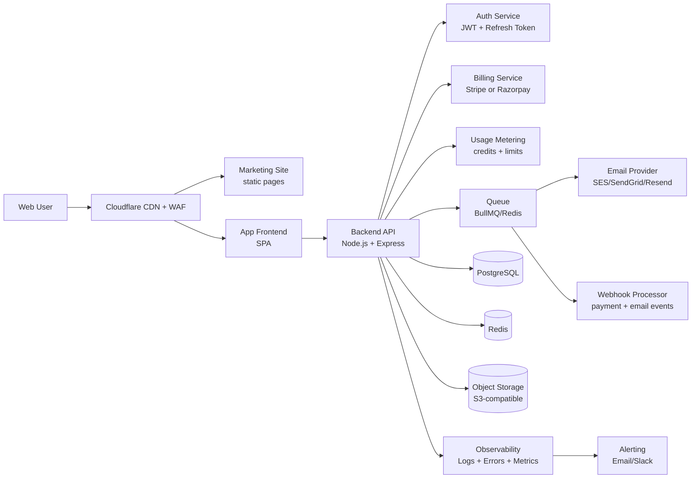

# AlcoveHire SaaS: Technical Architecture and Schema Plan

## 1) Target Architecture (MVP to Scale)

## 2) Environment Strategy

- `dev`: local development, test gateway keys, sample tenants.
- `staging`: production-like environment with sandbox billing and full regression checks.
- `prod`: real customers, live payment keys, locked config.

Required environment variables:
- `APP_BASE_URL`
- `API_BASE_URL`
- `DATABASE_URL`
- `REDIS_URL`
- `JWT_ACCESS_SECRET`
- `JWT_REFRESH_SECRET`
- `PAYMENT_PROVIDER`
- `PAYMENT_SECRET_KEY`
- `PAYMENT_WEBHOOK_SECRET`
- `SMTP_API_KEY` or provider-specific credentials
- `S3_ENDPOINT`, `S3_BUCKET`, `S3_ACCESS_KEY`, `S3_SECRET_KEY`
- `SENTRY_DSN` (or equivalent)

## 3) Multi-Tenant Rules (Non-Negotiable)

- Every business record must include `tenant_id`.
- API layer must scope all reads and writes by authenticated `tenant_id`.
- Never trust tenant IDs from client payloads.
- Add row-level indexes with `tenant_id` first for query speed.
- Add audit logs for security-sensitive actions.

## 4) Core Services

- Identity and Access: signup, login, invite users, role-based permissions.
- Tenant Management: account profile, workspace settings, seat limits.
- Recruiting Domain: candidates, clients, requirements, interviews, offers, invoices.
- Billing: subscriptions, renewals, proration, dunning, invoices, webhooks.
- Credits: ledger + balance + top-up + monthly reset behavior.
- Notifications: email reminders, interview alerts, billing notices.

## 5) Database Schema Plan (PostgreSQL)

## 5.1 Identity and Tenant

### `tenants`
- `id` (uuid, pk)
- `name` (varchar 160, not null)
- `slug` (varchar 80, unique, not null)
- `status` (enum: trial, active, past_due, canceled, suspended)
- `timezone` (varchar 50, default `UTC`)
- `created_at`, `updated_at`

Indexes:
- unique (`slug`)
- (`status`)

### `users`
- `id` (uuid, pk)
- `email` (varchar 190, unique, not null)
- `password_hash` (text, not null)
- `full_name` (varchar 140)
- `is_email_verified` (bool, default false)
- `created_at`, `updated_at`

### `tenant_users`
- `tenant_id` (uuid, fk -> tenants.id)
- `user_id` (uuid, fk -> users.id)
- `role` (enum: owner, admin, recruiter, viewer)
- `status` (enum: invited, active, disabled)
- `created_at`, `updated_at`

Constraints:
- pk (`tenant_id`, `user_id`)

Indexes:
- (`user_id`)
- (`tenant_id`, `role`)

## 5.2 Subscription and Billing

### `plans`
- `id` (uuid, pk)
- `code` (varchar 50, unique, not null)  // free, starter, growth, business
- `name` (varchar 80)
- `billing_cycle` (enum: monthly, yearly)
- `price_inr` (numeric 10,2)
- `included_users` (int)
- `included_ai_credits` (int)
- `candidate_limit` (int)
- `requirement_limit` (int)
- `is_active` (bool, default true)

### `subscriptions`
- `id` (uuid, pk)
- `tenant_id` (uuid, fk -> tenants.id)
- `plan_id` (uuid, fk -> plans.id)
- `provider` (enum: stripe, razorpay)
- `provider_customer_id` (varchar 120)
- `provider_subscription_id` (varchar 120)
- `status` (enum: trialing, active, past_due, canceled, unpaid)
- `current_period_start` (timestamptz)
- `current_period_end` (timestamptz)
- `cancel_at_period_end` (bool, default false)
- `created_at`, `updated_at`

Indexes:
- (`tenant_id`, `status`)
- unique (`provider`, `provider_subscription_id`)

### `payment_events`
- `id` (uuid, pk)
- `provider` (enum: stripe, razorpay)
- `provider_event_id` (varchar 120, unique)
- `event_type` (varchar 100)
- `payload` (jsonb)
- `processed_at` (timestamptz)
- `created_at`

## 5.3 Credits and Usage

### `credit_wallets`
- `tenant_id` (uuid, pk, fk -> tenants.id)
- `balance` (int, not null, default 0)
- `updated_at`

### `credit_ledger`
- `id` (uuid, pk)
- `tenant_id` (uuid, fk -> tenants.id)
- `entry_type` (enum: grant, consume, refund, expiry, topup)
- `amount` (int, not null)  // positive for grant/topup/refund, negative for consume/expiry
- `reference_type` (varchar 50)  // ai_resume_score, ai_match, admin_adjustment
- `reference_id` (varchar 120)
- `description` (varchar 255)
- `created_by` (uuid, fk -> users.id, nullable)
- `created_at` (timestamptz, default now)

Indexes:
- (`tenant_id`, `created_at` desc)
- (`tenant_id`, `reference_type`)

### `usage_counters`
- `id` (uuid, pk)
- `tenant_id` (uuid, fk -> tenants.id)
- `metric` (varchar 50)  // candidates, requirements, ai_calls
- `period_start` (date)
- `period_end` (date)
- `value` (int, default 0)
- `updated_at`

Constraints:
- unique (`tenant_id`, `metric`, `period_start`, `period_end`)

## 5.4 Recruiting Domain (Minimum)

### `clients`
- `id` (uuid, pk)
- `tenant_id` (uuid, fk)
- `name` (varchar 180)
- `industry` (varchar 80)
- `contact_name` (varchar 120)
- `contact_email` (varchar 190)
- `contact_phone` (varchar 30)
- `created_at`, `updated_at`

Indexes:
- (`tenant_id`, `name`)

### `requirements`
- `id` (uuid, pk)
- `tenant_id` (uuid, fk)
- `client_id` (uuid, fk -> clients.id)
- `title` (varchar 180)
- `status` (enum: open, in_progress, closed, canceled)
- `priority` (enum: low, medium, high)
- `openings` (int)
- `target_date` (date)
- `created_at`, `updated_at`

Indexes:
- (`tenant_id`, `status`)
- (`tenant_id`, `target_date`)

### `candidates`
- `id` (uuid, pk)
- `tenant_id` (uuid, fk)
- `full_name` (varchar 140)
- `email` (varchar 190)
- `phone` (varchar 30)
- `current_company` (varchar 160)
- `experience_years` (numeric 4,1)
- `status` (enum: lead, screening, interview, offered, joined, rejected, on_hold)
- `resume_url` (text)
- `created_at`, `updated_at`

Indexes:
- (`tenant_id`, `status`)
- (`tenant_id`, `email`)
- (`tenant_id`, `created_at` desc)

### `candidate_requirement_map`
- `id` (uuid, pk)
- `tenant_id` (uuid, fk)
- `candidate_id` (uuid, fk -> candidates.id)
- `requirement_id` (uuid, fk -> requirements.id)
- `stage` (enum: sourced, submitted, shortlisted, interview, offer, joined, rejected)
- `created_at`, `updated_at`

Indexes:
- (`tenant_id`, `requirement_id`, `stage`)
- (`tenant_id`, `candidate_id`)

### `interviews`
- `id` (uuid, pk)
- `tenant_id` (uuid, fk)
- `candidate_id` (uuid, fk)
- `requirement_id` (uuid, fk)
- `scheduled_at` (timestamptz)
- `round_name` (varchar 60)
- `mode` (enum: phone, virtual, onsite)
- `status` (enum: scheduled, completed, canceled, no_show)
- `feedback` (text)
- `created_at`, `updated_at`

Indexes:
- (`tenant_id`, `scheduled_at`)
- (`tenant_id`, `status`)

### `invoices`
- `id` (uuid, pk)
- `tenant_id` (uuid, fk)
- `invoice_number` (varchar 40)
- `client_id` (uuid, fk)
- `amount` (numeric 12,2)
- `currency` (varchar 3, default INR)
- `status` (enum: draft, issued, paid, overdue, canceled)
- `due_date` (date)
- `created_at`, `updated_at`

Constraints:
- unique (`tenant_id`, `invoice_number`)

## 5.5 Security and Audit

### `audit_logs`
- `id` (uuid, pk)
- `tenant_id` (uuid, fk)
- `actor_user_id` (uuid, fk -> users.id)
- `action` (varchar 80)
- `entity_type` (varchar 50)
- `entity_id` (uuid)
- `ip_address` (inet)
- `user_agent` (text)
- `metadata` (jsonb)
- `created_at` (timestamptz)

Indexes:
- (`tenant_id`, `created_at` desc)
- (`tenant_id`, `action`)

## 6) API Design Baseline

- Auth routes: `/auth/signup`, `/auth/login`, `/auth/refresh`, `/auth/logout`.
- Tenant routes: `/tenant/me`, `/tenant/users`, `/tenant/settings`.
- Recruiting routes: `/candidates`, `/clients`, `/requirements`, `/interviews`, `/invoices`.
- Billing routes: `/billing/checkout`, `/billing/portal`, `/billing/subscription`.
- Credits routes: `/credits/balance`, `/credits/ledger`, `/credits/topup`.
- Webhooks: `/webhooks/stripe` or `/webhooks/razorpay`.

## 7) Scaling and Reliability Milestones

- Milestone A (0-100 tenants): single API instance + managed Postgres.
- Milestone B (100-1000 tenants): autoscaling API, Redis cache, background workers.
- Milestone C (1000+ tenants): read replicas, partitioned large tables, per-tenant throttling.

## 8) Backup and Recovery

- Daily full backup + point-in-time recovery on database.
- Keep 30-day backup retention.
- Quarterly restore drill with documented runbook.
- Store backups encrypted and access-controlled.

## 9) Security Controls Checklist

- HTTPS everywhere, HSTS enabled.
- Password hashing with bcrypt/argon2.
- MFA optional at launch, mandatory for admin later.
- Role checks on every write endpoint.
- Rate limiting on auth and API endpoints.
- Strict input validation and output encoding.
- Secret rotation policy (90 days recommended).

## 10) Release Gates Before Paid Launch

- Tenant isolation tests pass.
- Billing webhooks idempotent and verified.
- Credit deductions tested for all AI features.
- Backup restore drill completed successfully.
- Legal pages linked in app and marketing site.
