# AlcoveHire Investor Pitch Deck (12-Slide Draft)

Presentation style guidance:
- Theme: clean enterprise style, white background, navy and teal accents.
- Font pairing: Manrope (headings), Source Sans 3 (body).
- Visual hierarchy: one message per slide, large metrics, short bullets.
- Suggested colors: #0F4C81 (primary), #1E7A73 (accent), #F4F7FB (background), #1D2736 (text).

---

## Slide 1: Title and Vision

Title:
- AlcoveHire
Subtitle:
- AI-Powered Recruitment Platform for High-Velocity Hiring Teams

Content:
- One-line vision: Help recruiters place better candidates faster with AI + workflow automation.
- Presenter details: founder name, role, date.

Visual:
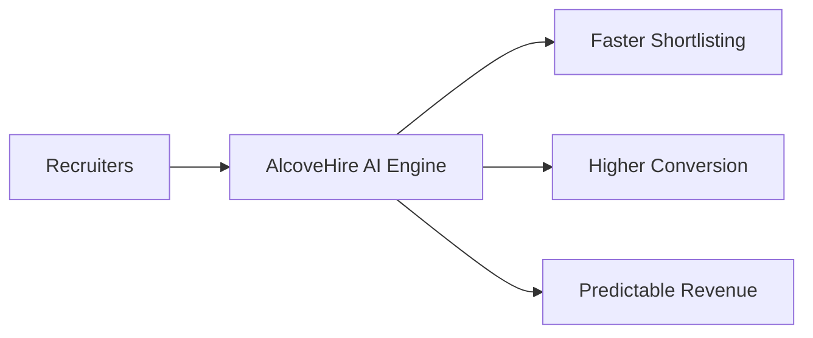

---

## Slide 2: Problem

Headline:
- Recruitment teams lose placements due to fragmented tools and manual work.

Key points:
- Candidate data scattered across sheets, email, WhatsApp, and multiple portals.
- Slow requirement-to-shortlist turnaround.
- Poor visibility across recruiter productivity and funnel leakage.
- Existing ATS tools are expensive or too complex for SMB agencies.

Visual:
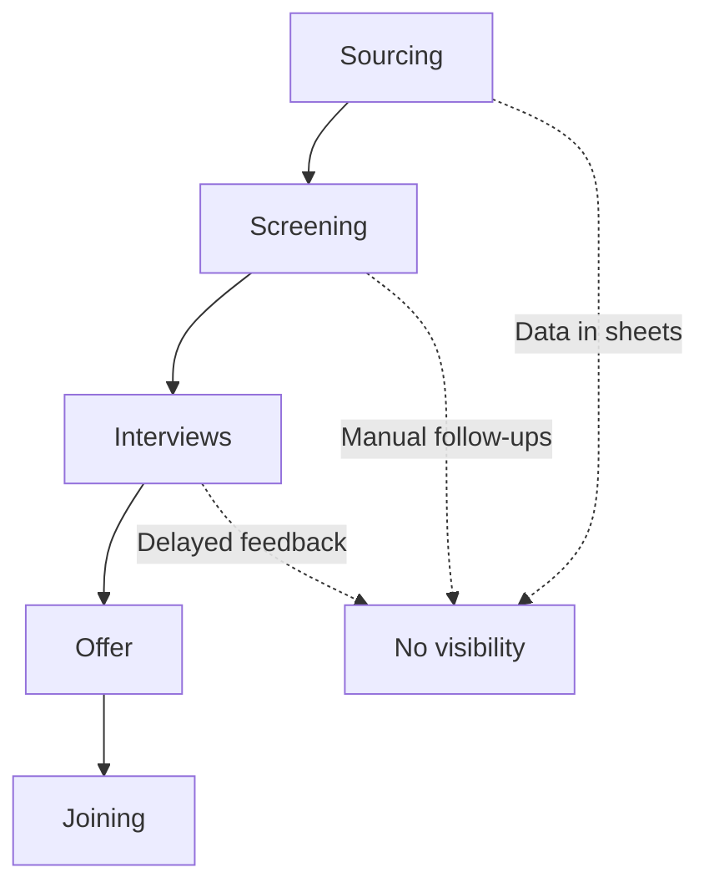

---

## Slide 3: Solution

Headline:
- A modern recruitment operating system with embedded AI.

Core solution blocks:
- End-to-end ATS workflow: candidates, requirements, interviews, invoices.
- AI modules: resume parsing, match scoring, candidate summaries, outreach drafting.
- Manager visibility: dashboards for pipeline, team productivity, and revenue.
- Built for agency and in-house TA workflows.

Visual:
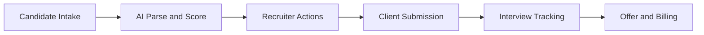

---

## Slide 4: Product Walkthrough

Headline:
- From requirement creation to placement in one system.

Demo storyline:
- Create requirement -> match candidates -> schedule interviews -> track stages -> generate invoices.
- Credit meter controls AI usage and upsell path.

Suggested product screenshots:
- Dashboard
- Candidate pipeline
- AI actions panel
- Subscription and credits page

Visual:
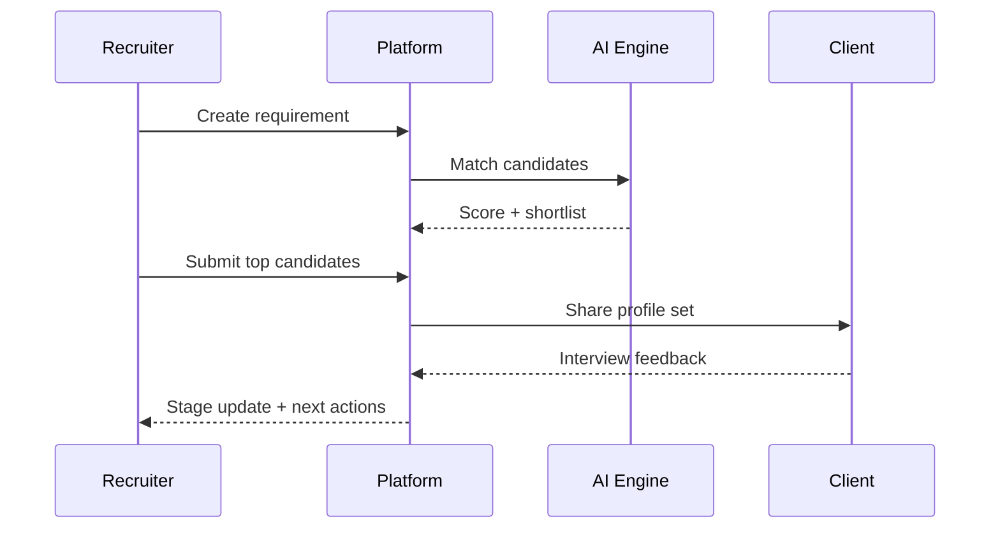

---

## Slide 5: Market Opportunity (TAM, SAM, SOM)

Headline:
- Large and growing demand in HRTech and recruitment digitization.

Template numbers to finalize:
- TAM: total HRTech + ATS addressable spend.
- SAM: SMB and mid-market recruitment teams in India + target geographies.
- SOM (3 years): realistic share through focused vertical GTM.

Visual:
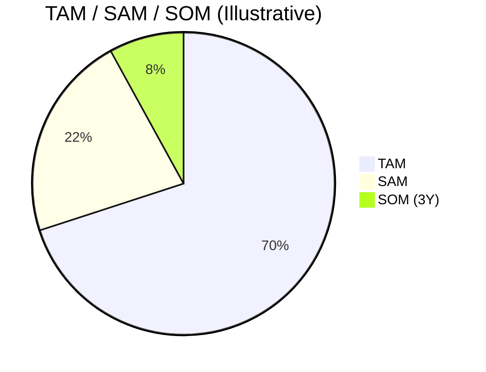

---

## Slide 6: Business Model and Pricing

Headline:
- Predictable subscription revenue with AI credit expansion.

Pricing summary:
- Starter: INR 2,999/month
- Growth: INR 7,999/month
- Business: INR 18,999/month
- Yearly plans: 20 percent discount
- Add-ons: extra users and AI credit packs

Visual:
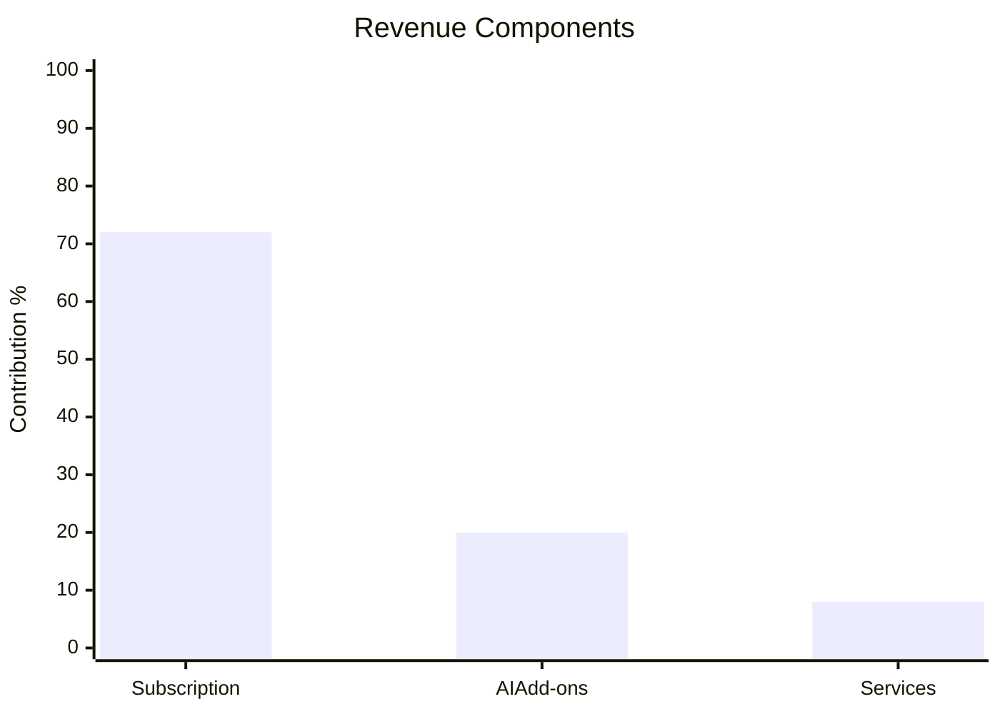

---

## Slide 7: Go-To-Market Strategy

Headline:
- Land with agencies, expand with referrals and partner channels.

GTM phases:
- Phase 1: founder-led sales to first 20 accounts.
- Phase 2: outbound + webinars + partner referrals for next 80 accounts.
- Phase 3: channel partnerships and targeted digital acquisition.

Visual:
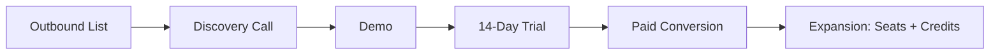

---

## Slide 8: Competitive Positioning

Headline:
- Better value-to-price fit for SMB and mid-market recruitment teams.

Comparison points:
- Ease of setup
- AI value per price
- Recruitment workflow depth
- Local market adaptability and support

Visual:
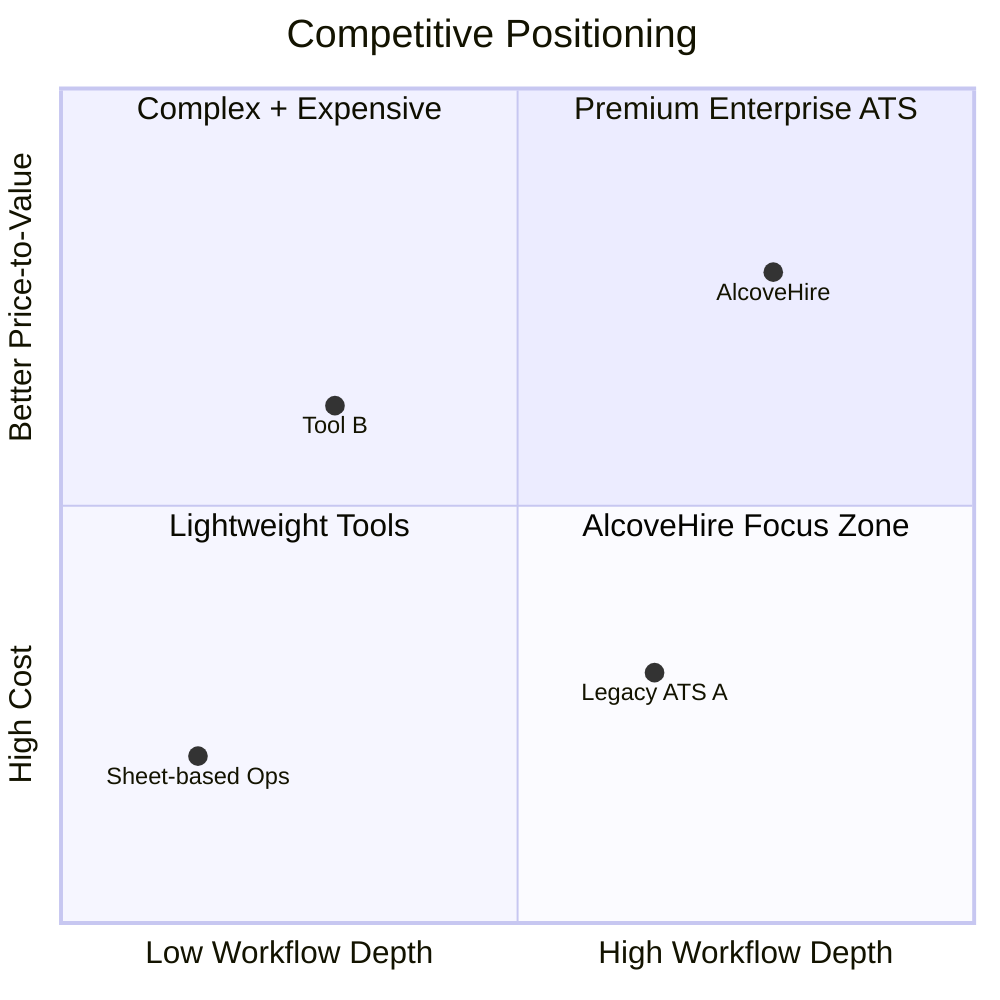

---

## Slide 9: Traction and Milestones

Headline:
- Clear execution milestones to launch and scale.

Milestones to show:
- Product readiness in 4 months.
- Pilot customers in month 3 to 4.
- 100 paying customers target by month 12.

Visual:
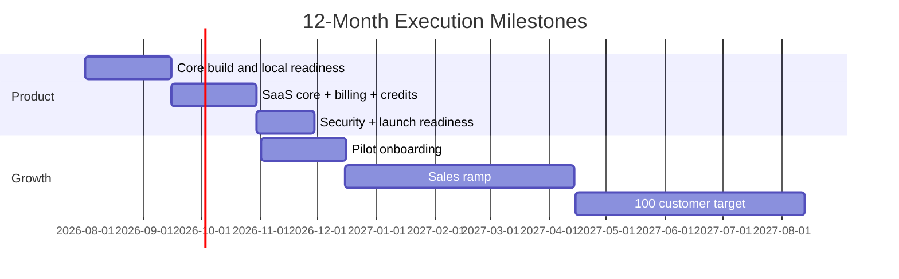

---

## Slide 10: Financial Snapshot (36-Month View)

Headline:
- Disciplined burn with a revenue-led scale plan.

Include in chart:
- MRR growth trajectory.
- Burn and runway.
- Gross margin assumptions.

Visual:
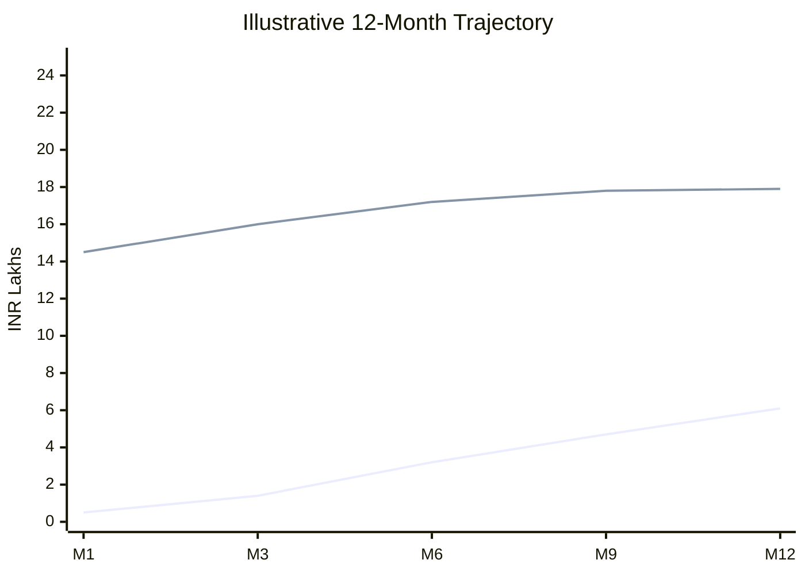
Legend:
- Line 1: MRR
- Line 2: Monthly burn

---

## Slide 11: Funding Ask and Use of Funds

Headline:
- Raising INR 2.2 Cr for 12-month runway and 100-customer milestone.

Use of proceeds:
- Product and engineering: 52%
- Sales and marketing: 28%
- Cloud and operations: 8%
- Legal and compliance: 2%
- Contingency reserve: 10%

Visual:
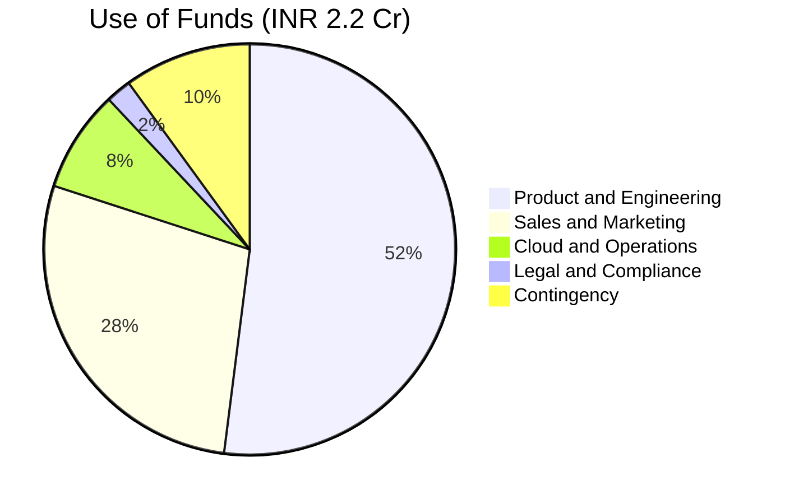

---

## Slide 12: Team, Roadmap, and Closing

Headline:
- Right team, clear roadmap, measurable outcomes.

Team snapshot:
- 2 frontend, 2 backend, 1 QA, 1 DevOps/Sec, 1 UI/UX, 1 PM.
- GTM: 1 sales lead, 2 sales execs, 1 customer success, 1 marketer.

Final slide close:
- Why now
- Why this team
- Why AlcoveHire wins
- Contact and next meeting ask

Visual:
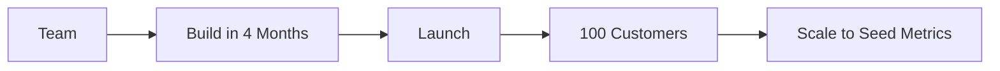

---

## Appendix Suggestions (Optional)

- Product screenshots by module.
- Pilot customer feedback.
- Unit economics detail.
- Data security and compliance overview.
