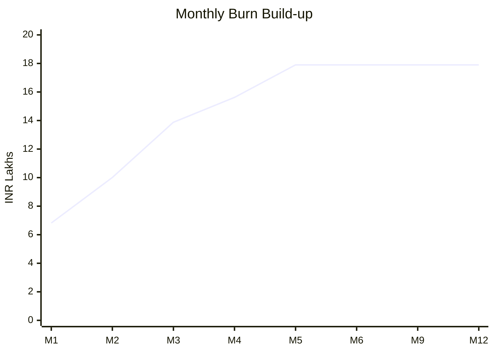

# AlcoveHire Hiring Plan by Month (Burn-Optimized)

Goal:
- Deliver product in 4 months.
- Start selling immediately after launch.
- Control burn by sequencing hires in phases.

## Hiring Strategy

- Do not hire full team on day one.
- Hire core build team first, GTM team in month 3 onward.
- Shift from fixed high burn to milestone-based hiring.

## Team Roles and Monthly Salary Assumptions (INR)

- Product Manager: 150000
- Frontend Developer: 90000 each
- Backend Developer: 120000 each
- QA Engineer: 60000
- DevOps and Security Engineer: 120000
- UI/UX Designer: 70000
- Sales Lead: 120000
- Sales Executive: 50000 each
- Customer Success Executive: 55000
- Performance Marketer: 70000

## Month-by-Month Hiring Timeline

| Month | New Joiners This Month | Total Active Team | Monthly Salary Cost |
|---|---|---:|---:|
| M1 | 1 Backend, 1 Frontend, 1 UI/UX, 1 PM | 4 | 4,30,000 |
| M2 | 1 Backend, 1 Frontend, 1 QA | 7 | 7,00,000 |
| M3 | 1 DevOps/Security, 1 Sales Lead, 1 Sales Executive | 10 | 9,90,000 |
| M4 | 1 Sales Executive, 1 Customer Success | 12 | 10,95,000 |
| M5 | 1 Performance Marketer | 13 | 11,65,000 |
| M6-M12 | No mandatory new hires (performance based) | 13 | 11,65,000 |

Add 18 percent people overhead (benefits and tools):
- M1: 5,07,400
- M2: 8,26,000
- M3: 11,68,200
- M4: 12,92,100
- M5 onward: 13,74,700 per month

## Burn Optimization Logic

- M1-M2 focus entirely on product build.
- Sales hires begin in M3 when demo is stable.
- Customer success starts at launch prep in M4.
- Marketing starts in M5 to convert trial interest after launch.
- Delay non-critical hires until conversion metrics justify scale.

## Timeline to Commit Externally

- End of M1: app fully runnable locally with seeded environments.
- End of M2: core SaaS features complete (auth, tenant, API modules).
- End of M3: billing, credits, security baseline, pilot-ready build.
- End of M4: production-ready launch candidate.
- M5 onward: structured GTM and sales conversion.

## Operating Cost Timeline (People + Infra + Ops + Sales)

Assumptions:
- Infra and platform before launch: 45,000 to 70,000/month
- Infra after launch: 90,500/month
- Business ops: 50,000/month
- Sales and marketing spend:
  - M1-M2: 80,000/month
  - M3-M4: 1,50,000/month
  - M5 onward: 2,75,000/month

Estimated total monthly burn:
- M1: 6,82,400
- M2: 10,01,000
- M3: 13,88,200
- M4: 15,62,100
- M5 onward: 17,90,200

## 12-Month Hiring and Cost Curve

## Hiring Governance for Investors

- Hiring gates tied to milestones, not dates only.
- Gate 1: M2 complete only then hire DevOps + Sales Lead.
- Gate 2: pilot conversion above 10 percent then expand sales.
- Gate 3: 30 paid customers then add additional sales pods.

## Suggested Expansion Plan After 100 Customers

- Add 1 backend and 1 QA when average API latency or bug backlog crosses threshold.
- Add 2 sales executives only if CAC payback less than 9 months.
- Add 1 customer success manager at 150 customers to reduce churn.

## Investor Talking Points

- Team is intentionally lean in first 4 months to reduce burn.
- Cost scaling is tied to measurable business outcomes.
- Build-first then GTM ramp improves runway discipline.
- Plan supports a credible 4-month launch commitment.
